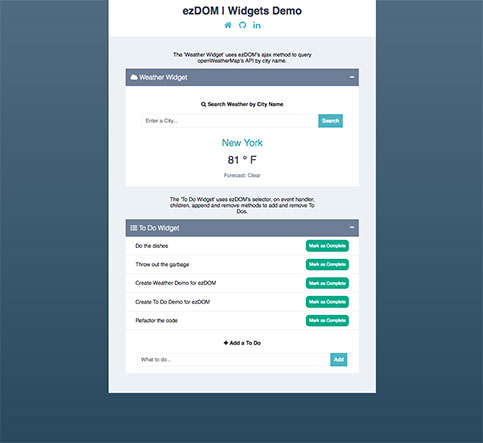

# ezDOM (`$ez`)

ezDOM or `$ez` for short, is a JavaScript DOM interaction library drawing inspiration from jQuery.

## Live Demo


ezDOM Widgets displays nearly all the functionality of ezDOM.
Including methods (selector, children, append, remove, empty, attr, toggleClass and ajax)

[See ezDOM in action with a live Widget Demo](http://markpassando.com/ezDOM)

## Getting Started

Include the ez_dom.js library in your source code like so.
```html
<head>
  <meta charset="utf-8">
  <script type="text/javascript" src="./ez_dom.js"></script>
  <link rel="stylesheet" href="./styles.css">
</head>
```

## Feature List

### DOM Traversal
  * [`children`](#children)
  * [`parent`](#parent)
  * [`each`](#each)

### DOM Manipulation
  * [`html`](#html)
  * [`empty`](#empty)
  * [`append`](#append)
  * [`remove`](#remove)
  * [`attr`](#attr)
  * [`addClass`](#addclass)
  * [`removeClass`](#removeclass)
  * [`toggleClass`](#toggleclass)

### Event Listeners
  * [`on`](#on)
  * [`off`](#off)

### ajax
  * [`ajax`](#ajax)

## Features
### `children`
  `$('ul').children()` - Grabs all of the selected elements immediate children into a collection of an `$ez` object.
### `parent`
  `$('li').parent()` - Grabs all unique parents of the selected element and returns a collection of an `$ez` object.
### `each`
  `each(callback)` - takes a callback function to invoke on each element.
  `$('ul').children().each(el => console.log(el))` - Will grab each child element in the ul and console log each child.

## DOM Manipulation
### `html`
  `html(string)` - Takes an optional string
  `$ez('#my-el').html()` - returns the innerHtml of `#my-el`
  `$ez('#my-el').html('foo')` - `html` takes an optional parameter of a `string` and sets the innerHtml of `#my-el` to that string.

### `empty`
  `$ez('#my-el').empty()` - sets `#my-el` innerHtml to an empty string.

### `append`
  `append(string/HTMLElement/$ez object)`js - Can take a string, a HTMLElement or an $ez object.
  string parameter
  `$ez('#my-el').append('foo')` - appends 'foo' to the inside of `#my-el`.
  HTMLElement
  `$ez('#my-el').append('<p>foo</p>')` - appends HTMLElement <p>foo</p> inside of `#my-el`.
  $ez object
  `let foo = $ez('#my-foo')` - assign and instance of $ez to variable called foo.
  `$ez('#my-el').append(foo)` - appends the foo innerHtml inside of `#my-el`.

### `remove`
  `$ez('#my-el').remove()` - Removes the element and it's child elements from the DOM.

### `attr`
  ```html
  <html>
    <input id="my-input" type="text" value="My default sample value!" />
  </html>
  ```
  `$ez('#my-input').attr('value')` - Will return the value of the selected attribute. This returns 'My default sample value!'.
  `$ez('#my-input').attr('value', 'EZ to add a new value')` - Will set the vaue to the second parameter. This will return 'EZ to add a new value'.

### `addClass`
  `$ez('#my-el').addClass('foo')` - Adds the class 'foo' to `#my-el`

### `removeClass`
  `$ez('#my-el').removeClass('foo')` - Removes the class 'foo' to `#my-el`

### `toggleClass`
  `$ez('#my-el').toggleClass('foo')` - If class 'foo' exists, it will remove it. Otherwise it will add 'foo' to `#my-el`.

## Event Listeners
### `on`
 `$ez('#my-el').on(event, callBackFunction)` - Takes an event and callback function as parameters.
 `$ez('#my-el').on('click', () => alert('You clicked on me!'))` - Adds a click event listener to `#my-el`, when the listener is invoked it will call the function and alert 'You clicked on me!'.

### `off`
  `$ez('#my-el').off('click')` - Turns off all of the `$ez` event listeners for the event 'click'.

## ajax
### `$ez.ajax`
````js
$ez.ajax({
   method: "GET",
   url:  "http://api.openweathermap.org/data/2.5/weather",
   data: { appid: "6593357a84983f34982acc13f791e08d", q: "NY,NY" },
   success: response => {
     console.log("Return the Response!");
     console.log(response);
   },
   error: error => {
     console.log("Return the Error!");
     console.log(error);
   }
 });
````
The example above shows an example getting weather from openweathermap API.

`$ez.ajax` takes a JSON object with the following parameters 'method', 'url', 'data', 'success' and 'error'

If the API call is successful it will callback the function passed to success otherwise it will call the error function.
